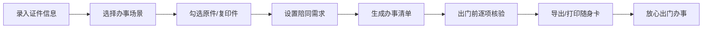

## 1. 产品概述

为家中长者打造的证件收纳与办事清单预演工具，解决老人出门办事忘带证件、遗漏资料的痛点。
- 核心价值：通过数字化管理证件存放位置，按场景组合办事清单，模拟出门核验，确保万无一失
- 目标用户：家中有老人的家庭成员，以及有一定操作能力的老年人

## 2. 核心 Features

### 2.1 Feature Module

1. **证件收纳区**：录入证件信息、资料照片占位、存放位置管理
2. **办事情景库**：预设"看病""取药""领补贴""银行卡挂失""社保认证"等场景
3. **清单预演面板**：勾选原件/复印件、设置是否需要陪同、生成大字版核对卡
4. **大字打印预览**：出门前逐项核验，支持导出图片和打印随身卡

### 2.3 Page Details

| 页面名称 | 模块名称 | Feature description |
|-----------|-------------|---------------------|
| 主界面 | 证件收纳区 | 证件卡片列表、添加/编辑/删除证件、照片占位、存放位置标注 |
| 主界面 | 办事情景库 | 场景卡片展示、自定义场景、场景关联证件选择 |
| 主界面 | 清单预演面板 | 原件/复印件勾选、陪同人员设置、核验进度条 |
| 主界面 | 大字打印预览 | 超大字体核对卡、逐项勾选核验、导出图片、打印功能 |

## 3. 核心流程

## 4. User Interface Design

### 4.1 Design Style

**设计理念：温暖、清晰、易用**
- **主色调**：暖橙色 `#FF8C42`（温暖、活力） + 深青色 `#2A9D8F`（稳重、可信）
- **辅助色**：米白色背景 `#FFF8F0`、暖黄色强调 `#F4D35E`
- **按钮风格**：大圆角（16px）、厚实阴影、大点击区域，适合老人操作
- **字体**：
  - 标题："Noto Sans SC" 粗体，字号偏大
  - 正文："Noto Sans SC" 常规，最小字号 16px
  - 大字模式：28px-48px 超大字号
- **布局风格**：卡片式布局，大间距，清晰的视觉层次
- **图标**：圆润可爱的 emoji 风格图标，如 🆔、💊、🏥、💰、📋

### 4.2 Page Design Overview

| 页面名称 | 模块名称 | UI Elements |
|-----------|-------------|-------------|
| 主界面 | 证件收纳区 | 卡片网格、彩色证件图标、照片占位框、位置标签 |
| 主界面 | 办事情景库 | 横向滚动场景卡、emoji 图标、场景描述文字 |
| 主界面 | 清单预演面板 | 复选框列表、原件/复印件切换开关、陪同人员选择器 |
| 主界面 | 大字打印预览 | 黄色背景模拟便签纸、超大字号、勾选动画、操作按钮组 |

### 4.3 Responsiveness

- 桌面端优先设计，适配 1280px 以上宽度
- 自适应布局，支持平板设备
- 所有按钮最小尺寸 44x44px，支持触控操作
- 大字模式专为老人优化，文字对比度 ≥ 4.5:1

### 4.4 无障碍设计

- 高对比度配色方案
- 可调节字体大小
- 清晰的图标+文字双重标识
- 键盘导航支持
