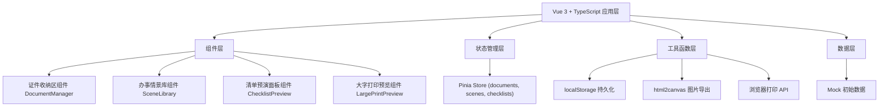
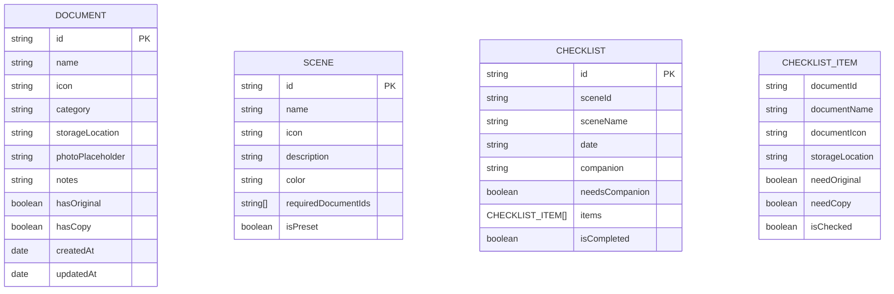

## 1. Architecture Design



## 2. Technology Description

- **前端框架**: Vue 3.4 + TypeScript 5.4 + Vite 5.2
- **状态管理**: Pinia 2.1
- **样式方案**: TailwindCSS 3.4 + CSS 变量
- **UI 图标**: Lucide Vue Next（同时使用 emoji 增强亲和力）
- **图片导出**: html2canvas 1.4
- **开发服务器**: Vite，端口 9410
- **数据存储**: localStorage 本地持久化
- **纯前端**: 无后端服务，所有数据本地存储

## 3. Route Definitions

| Route | Purpose |
|-------|---------|
| / | 主应用界面，单页应用，无路由切换 |

## 4. Data Model

### 4.1 Data Model Definition



### 4.2 TypeScript Type Definitions

```typescript
interface Document {
  id: string;
  name: string;
  icon: string;
  category: 'identity' | 'medical' | 'finance' | 'social' | 'other';
  storageLocation: string;
  photoPlaceholder: string;
  notes: string;
  hasOriginal: boolean;
  hasCopy: boolean;
  createdAt: string;
  updatedAt: string;
}

interface Scene {
  id: string;
  name: string;
  icon: string;
  description: string;
  color: string;
  requiredDocumentIds: string[];
  isPreset: boolean;
}

interface ChecklistItem {
  documentId: string;
  documentName: string;
  documentIcon: string;
  storageLocation: string;
  needOriginal: boolean;
  needCopy: boolean;
  isChecked: boolean;
}

interface Checklist {
  id: string;
  sceneId: string;
  sceneName: string;
  date: string;
  companion: string;
  needsCompanion: boolean;
  items: ChecklistItem[];
  isCompleted: boolean;
  createdAt: string;
}

type AppState = {
  documents: Document[];
  scenes: Scene[];
  checklists: Checklist[];
  activeScene: Scene | null;
  currentChecklist: Checklist | null;
};
```

### 4.3 Mock Initial Data

```typescript
// 预设证件
const presetDocuments: Document[] = [
  {
    id: 'doc-1',
    name: '身份证',
    icon: '🆔',
    category: 'identity',
    storageLocation: '卧室抽屉第1层',
    photoPlaceholder: '',
    notes: '正反面复印2份备用',
    hasOriginal: true,
    hasCopy: true,
    createdAt: '2024-01-01',
    updatedAt: '2024-01-01'
  },
  {
    id: 'doc-2',
    name: '医保卡',
    icon: '💳',
    category: 'medical',
    storageLocation: '钱包内层',
    photoPlaceholder: '',
    notes: '记得每月缴费',
    hasOriginal: true,
    hasCopy: false,
    createdAt: '2024-01-01',
    updatedAt: '2024-01-01'
  },
  {
    id: 'doc-3',
    name: '病历本',
    icon: '📋',
    category: 'medical',
    storageLocation: '客厅文件盒',
    photoPlaceholder: '',
    notes: '最近一次看病记录在内页',
    hasOriginal: true,
    hasCopy: false,
    createdAt: '2024-01-01',
    updatedAt: '2024-01-01'
  }
];

// 预设场景
const presetScenes: Scene[] = [
  {
    id: 'scene-1',
    name: '看病',
    icon: '🏥',
    description: '去医院就诊需要的证件',
    color: '#FF6B6B',
    requiredDocumentIds: ['doc-1', 'doc-2', 'doc-3'],
    isPreset: true
  },
  {
    id: 'scene-2',
    name: '取药',
    icon: '💊',
    description: '去药店或医院取药',
    color: '#4ECDC4',
    requiredDocumentIds: ['doc-1', 'doc-2'],
    isPreset: true
  },
  {
    id: 'scene-3',
    name: '领补贴',
    icon: '💰',
    description: '领取养老金、补贴等',
    color: '#95E1D3',
    requiredDocumentIds: ['doc-1'],
    isPreset: true
  },
  {
    id: 'scene-4',
    name: '银行卡挂失',
    icon: '🏦',
    description: '办理银行卡挂失补办',
    color: '#F38181',
    requiredDocumentIds: ['doc-1'],
    isPreset: true
  },
  {
    id: 'scene-5',
    name: '社保认证',
    icon: '✅',
    description: '养老金资格认证',
    color: '#AA96DA',
    requiredDocumentIds: ['doc-1'],
    isPreset: true
  }
];
```

## 5. 项目结构

```
src/
├── components/
│   ├── DocumentManager.vue    # 证件收纳区
│   ├── SceneLibrary.vue       # 办事情景库
│   ├── ChecklistPreview.vue   # 清单预演面板
│   ├── LargePrintPreview.vue  # 大字打印预览
│   ├── DocumentCard.vue       # 证件卡片
│   ├── SceneCard.vue          # 场景卡片
│   └── ChecklistItem.vue      # 清单项
├── stores/
│   └── app.ts                 # Pinia 状态管理
├── types/
│   └── index.ts               # TypeScript 类型定义
├── mock/
│   └── initialData.ts         # 初始模拟数据
├── utils/
│   ├── storage.ts             # localStorage 工具
│   ├── export.ts              # 导出图片工具
│   └── print.ts               # 打印工具
├── App.vue                    # 根组件
├── main.ts                    # 入口文件
└── style.css                  # 全局样式
```
